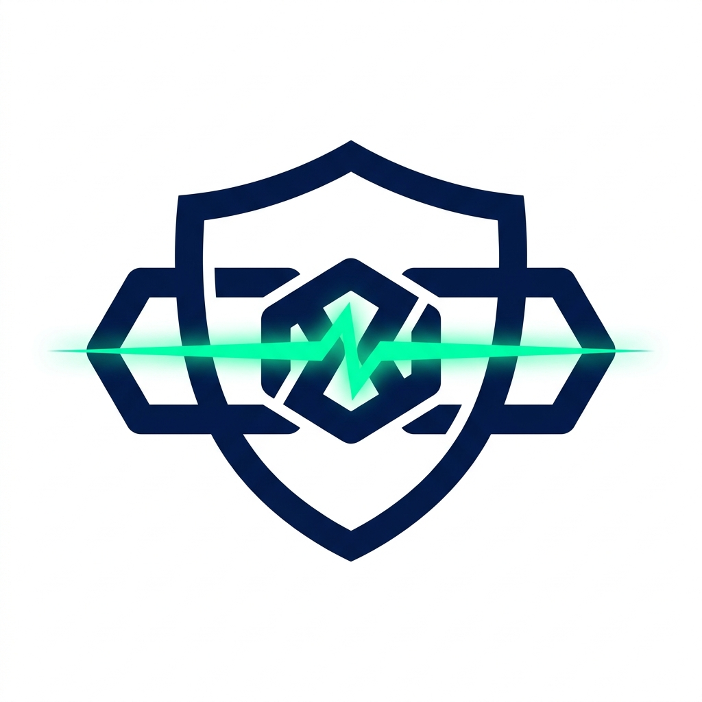

#  ChainGuard

### **AI-Powered Smart Contract Security Auditor on CROO CAP**

[](LICENSE)
[](https://croo.network)
[](https://anthropic.com)
[](https://base.org)
[](#)

---

## 🧠 What is ChainGuard? (Explain Like I'm 5)

Imagine you are building a house. Before you move in, you want to make sure the roof won't collapse and the doors lock properly. Typically, you'd hire a home inspector, pay them thousands of dollars, and wait weeks for a report.

**ChainGuard is like an instant, automated inspector for smart contracts (blockchain code).** 

Instead of waiting weeks and paying $10,000+ for a human auditing firm, you send your smart contract code to ChainGuard. In **under 30 seconds** and for just **0.10 USDC (ten cents)**, ChainGuard's AI engine scans the code, finds security flaws (vulnerabilities), rates how dangerous they are, and tells you exactly how to fix them.

---

## ⚡ Quick Start: How to Get an Audit (No Technical Skills Required)

You don't need to know how to code to use ChainGuard. You can hire the agent directly from your web browser:

1. **Go to the Agent Store:** Open the **[CROO Agent Store](https://agent.croo.network)**.
2. **Find ChainGuard:** Search for the **Smart Contract Audit** service.
3. **Submit Your Code:** 
   - Paste a deployed smart contract address (like `0x...` on Ethereum/Base), OR
   - Paste the raw Solidity code directly into the input box.
4. **Pay & Run:** Approve the **0.10 USDC** payment. 
5. **Get Your Report:** Within **30 seconds**, your detailed security audit report will be delivered directly to your dashboard!

---

## 🚀 Key Features

* **⚡ Lightning Fast:** Audits are generated and delivered in under 30 seconds (100x faster than traditional audits).
* **🔍 Deep AI Inspection:** Powered by Anthropic's state-of-the-art Claude AI model to catch complex vulnerabilities like Reentrancy, Overflow, and Access Control bypasses.
* **📊 Risk Scoring:** Provides a clear security score from `0` (Critical Risk) to `100` (Perfect Security).
* **💡 Actionable Fixes:** Every vulnerability found comes with a clear explanation and the exact code changes needed to fix it.
* **⛽ Gas Optimization:** Tells you how to write more efficient code to save your users money on transaction fees (gas).
* **🔗 Cryptographic Proof:** Every audit report is mathematically hashed (SHA-256), providing a permanent, verifiable proof of the audit on-chain.

---

## 📋 Example Audit Output

Here is a preview of the clean, structured report you receive:

```json
{
  "overallScore": 15,
  "riskLevel": "Critical",
  "vulnerabilities": [
    {
      "name": "Classic Reentrancy Vulnerability",
      "severity": "Critical",
      "description": "The withdraw() function transfers funds to msg.sender before setting their balance to zero, allowing an attacker to repeatedly call withdraw() and drain the contract.",
      "recommendation": "Update the user's balance BEFORE sending funds (Checks-Effects-Interactions pattern)."
    }
  ],
  "summary": "This contract has critical security vulnerabilities. Do NOT deploy this to mainnet until you fix the reentrancy flaw.",
  "gasOptimizations": [
    {
      "description": "Use 'unchecked' blocks for arithmetic operations where overflow is impossible.",
      "estimatedSavings": "~200 gas per transaction"
    }
  ]
}
```

---

## ⚙️ How It Works Under the Hood

```
   [ User / Client ] 
           │
           │  1. Request Audit & Pay 0.10 USDC
           ▼
   [ CROO CAP Protocol ]
           │
           │  2. Directs order to ChainGuard Agent
           ▼
    [ ChainGuard Agent ] ──► 3. Fetches contract source from Etherscan (if address)
           │
           ├───► 4. Passes code to Anthropic Claude for AI security scan
           │
           ├───► 5. Generates SHA-256 cryptographic proof of the audit
           ▼
   [ Delivery on Base ] ◄── 6. Delivers JSON report & proof hash back to User
```

---

## 🛠️ Developer Guide (Self-Hosting & Running the Agent)

If you are a developer and want to run your own ChainGuard agent node on the CROO network, follow these steps.

### 1. Prerequisites
- **Node.js** (v18 or higher)
- **Base Network Wallet** with some gas fee funds
- **Anthropic API Key** (for Claude AI)
- **Etherscan API Key** (for fetching contract code by address)
- **CROO Developer SDK Key**

### 2. Installation
Clone the repository and install dependencies:
```bash
git clone https://github.com/Miracle-Alajemba/chainguard.git
cd chainguard
npm install
```

### 3. Environment Setup
Create a `.env` file in the root directory:
```env
CROO_API_URL=https://api.croo.network
CROO_WS_URL=wss://api.croo.network/ws
CROO_SDK_KEY=your_croo_sdk_key
WALLET_PRIVATE_KEY=your_wallet_private_key
ANTHROPIC_API_KEY=your_anthropic_api_key
ETHERSCAN_API_KEY=your_etherscan_api_key
```

### 4. Running the Agent
Start the agent in development mode:
```bash
npm start
```
Or build and run in production mode:
```bash
npm run build
npm run start:prod
```

For detailed step-by-step instructions on deploying the wallet, setting up services, and acquiring keys, read the **[SETUP.md](SETUP.md)** guide.

---

## 📂 Project Structure

* **[src/index.ts](file:///home/miracle-alajemba/Desktop/chainguard/src/index.ts)** — Entry point of the application. Displays startup banners and handles process events.
* **[src/provider.ts](file:///home/miracle-alajemba/Desktop/chainguard/src/provider.ts)** — Manages connection to CROO CAP, listens for events, and handles the order lifecycle.
* **[src/auditor.ts](file:///home/miracle-alajemba/Desktop/chainguard/src/auditor.ts)** — Integrates with Anthropic Claude AI to perform security scanning and structure reports.
* **[src/fetcher.ts](file:///home/miracle-alajemba/Desktop/chainguard/src/fetcher.ts)** — Fetches verified smart contract source code from Etherscan APIs.
* **[src/hasher.ts](file:///home/miracle-alajemba/Desktop/chainguard/src/hasher.ts)** — Generates secure SHA-256 cryptographic hashes for deliverables.

---

## 🤝 CROO CAP Protocol Details

ChainGuard is a **Provider Agent** operating under the Compute Agent Protocol (CAP).

| Parameter | Value |
|-----------|-------|
| **Service Price** | `0.10 USDC` (100,000 base units) |
| **SLA (Max Delivery Time)** | `5 minutes` (Actual: under 30 seconds) |
| **Payment Token** | USDC on Base (`0x833589fCD6eDb6E08f4c7C32D4f71b54bdA02913`) |
| **Deliverable Type** | Text (JSON formatted) + Cryptographic Proof Hash |

---

## ❓ FAQ

### 1. Why is it so cheap?
Traditional audits require hours of manual labor by highly paid security engineers. ChainGuard leverages AI models that can analyze thousands of lines of code in seconds, keeping operating costs minimal.

### 2. Can I trust an AI audit?
AI audits are incredibly fast and cost-effective, making them perfect for **continuous testing during development** or for smaller projects. However, they should not completely replace a final human audit for high-value mainnet protocols holding millions of dollars.

### 3. Does it keep my code private?
ChainGuard does not store your code. The code is fetched, sent to the Claude API for analysis, and the report is delivered. All processing happens in-memory.

---

## 📄 License

This project is licensed under the MIT License - see the LICENSE file for details.
